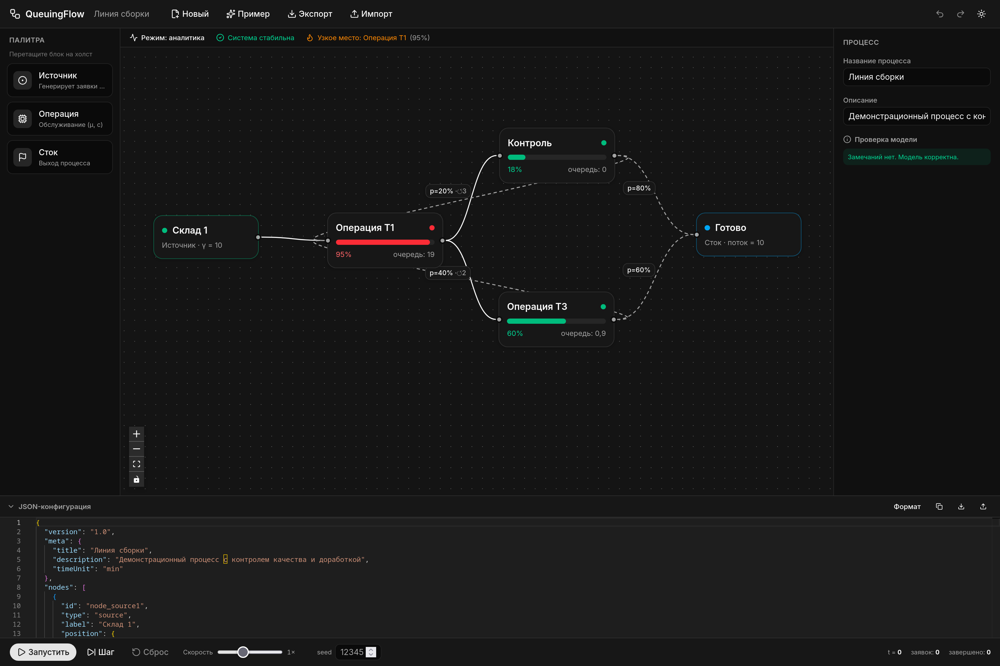

# QueuingFlow

Веб-приложение для построения, аналитического расчёта и имитационной симуляции
технологических процессов как систем массового обслуживания (СМО, сети Джексона).

Полное ТЗ: [docs/specification.md](docs/specification.md).



## Возможности

- **Холст (React Flow):** drag-and-drop узлов (источник / операция / сток), связи,
  ветвления и циклы с обратной связью.
- **JSON-редактор (Monaco):** двусторонняя синхронизация с графом, валидация формы.
- **Аналитика (онлайн):** открытая сеть Джексона — уравнения трафика + метрики M/M/c
  (ρ, L_q, W_q, W), индикация нестабильности (ρ ≥ 1) и узкого места.
- **Симуляция (по запросу):** дискретно-событийная модель с анимацией потока,
  управлением play/pause/step/reset, скоростью и воспроизводимым seed; учитывает
  `max_loops`, ёмкость очереди и дисциплину.
- Цветовая индикация загрузки, трёхуровневое раскрытие данных узла (блок → tooltip →
  боковая панель), undo/redo, автосохранение в localStorage, импорт/экспорт `.json`.

## Быстрый старт

### 1. Установка Bun

**Linux / macOS / WSL:**

```bash
curl -fsSL https://bun.sh/install | bash
```

После установки перезапустите терминал (или выполните `source ~/.bashrc` /
`source ~/.zshrc`), затем проверьте:

```bash
bun --version
```

**Windows (PowerShell):**

```powershell
powershell -c "irm bun.sh/install.ps1 | iex"
```

Альтернативы:

- через `npm` (любая платформа): `npm install -g bun`
- через `scoop` (Windows): `scoop install bun`
- через `brew` (macOS): `brew install oven-sh/bun/bun`

> Минимально поддерживаемая версия Bun — **1.1+**. На Windows рекомендуется
> Windows 10/11 либо WSL2.

### 2. Клонирование и установка зависимостей

```bash
git clone https://github.com/F0rgenet/queuing-flow.git queuing-flow
cd queuing-flow
bun install
```

### 3. Запуск дев-сервера (для разработки)

```bash
bun run dev
```

Откройте [http://localhost:5173](http://localhost:5173)

### 4. Прод-сборка и предпросмотр

```bash
bun run build      # собирает приложение
bun run preview    # поднимает локальный сервер для предпросмотра
```

После `bun run preview` откройте [http://localhost:4173](http://localhost:4173).

## Команды

```bash
bun run dev         # дев-сервер (http://localhost:5173)
bun run build       # прод-сборка (tsc -b + vite build)
bun run preview     # локальный просмотр прод-сборки
bun run typecheck   # проверка типов TypeScript
bun run lint        # ESLint
bun run format      # Prettier
```

## Архитектура — Feature-Sliced Design

Импорты направлены строго вниз: `app → pages → widgets → features → entities → shared`.
Каждый слайс имеет публичный API через `index.ts`; внутренние модули наружу не импортируются.

```
src/
├── app/                      # композиция приложения, провайдеры
├── pages/editor/             # страница-редактор (сборка виджетов)
├── widgets/                  # композитные блоки UI
│   ├── toolbar/              #   меню, undo/redo, тема, импорт/экспорт
│   ├── node-palette/         #   палитра перетаскиваемых узлов
│   ├── flow-canvas/          #   холст React Flow + кастомные узлы/связи
│   ├── json-editor/          #   Monaco-редактор
│   ├── inspector-sidebar/    #   панель параметров (Уровень 3) + валидация
│   ├── simulation-controls/  #   панель управления симуляцией
│   └── stats-panel/          #   статус системы и узкое место
├── features/                 # сценарии-приложения над моделью
│   ├── analytics/            #   движок сети Джексона + стор результатов
│   ├── simulation/           #   DES-симулятор, ГСЧ, распределения, контроллер
│   ├── json-sync/            #   двусторонняя синхронизация JSON↔граф
│   └── persistence/          #   localStorage, импорт/экспорт
├── entities/
│   └── process-model/        # ЕДИНСТВЕННАЯ доменная сущность:
│       ├── model/            #   типы, дефолты, zustand-стор + история
│       └── lib/              #   routing, validator, serializer, flow-adapter
└── shared/                   # переиспользуемое, без доменной логики
    ├── config/               #   пороги/цвета статуса, DnD-MIME
    ├── lib/                  #   math (Гаусс), id, format, cn, theme
    └── ui/                   #   button, поля форм
```
