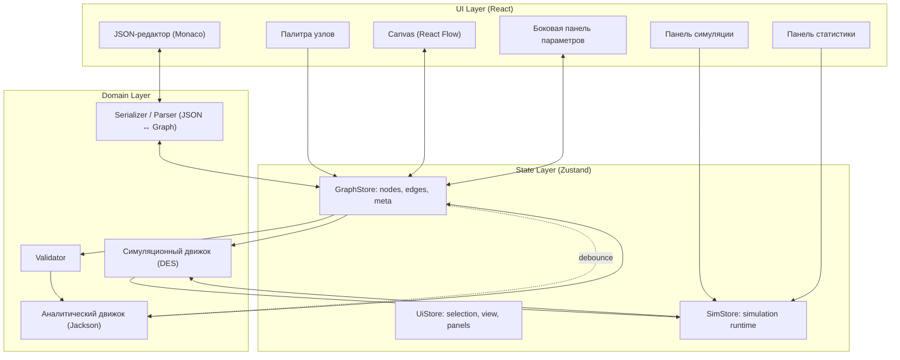
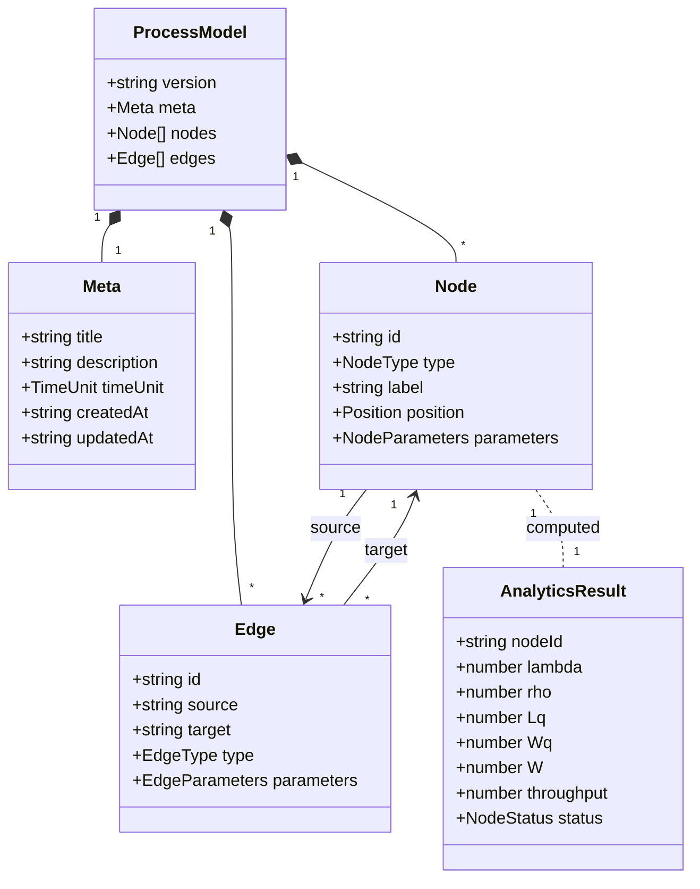
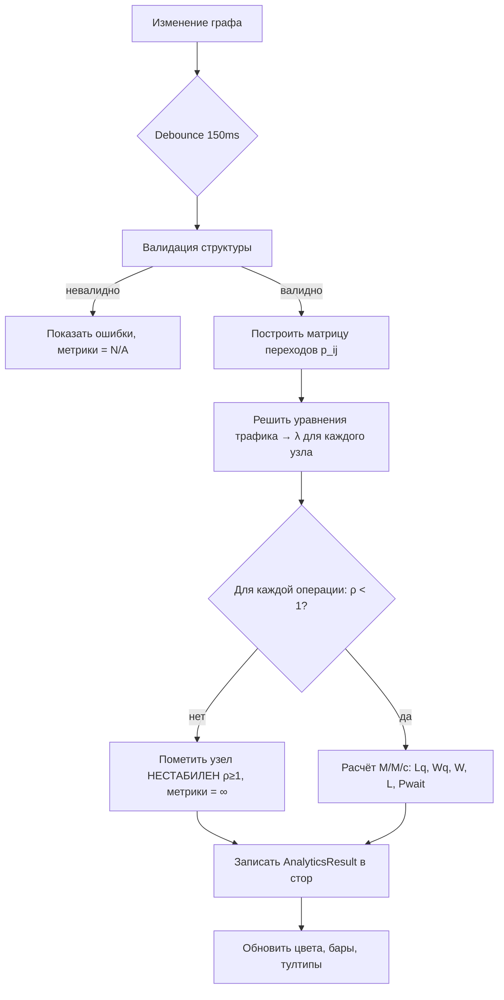
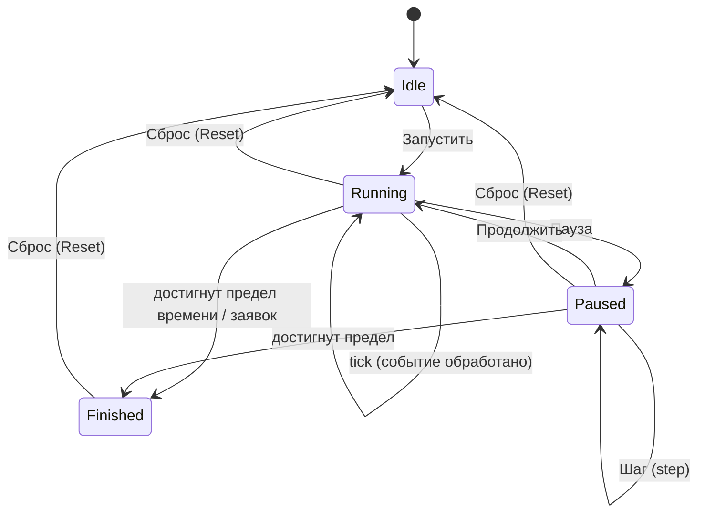
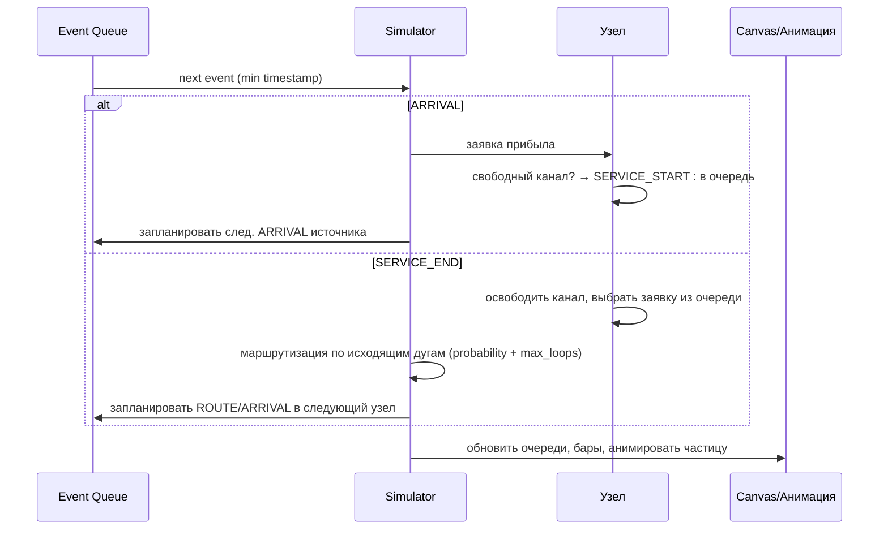
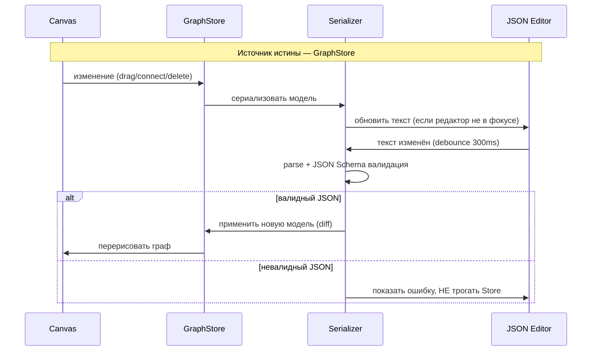
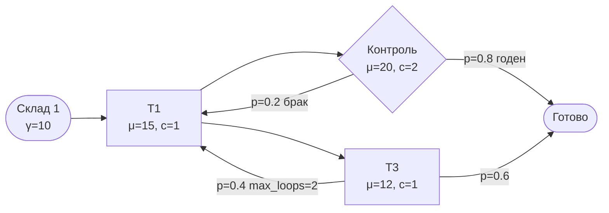

# Техническое задание: QueuingFlow

**Веб-приложение для построения, симуляции и аналитического расчёта технологических процессов как систем массового обслуживания (СМО)**

| | |
| --- | --- |
| Версия документа | 1.0 |
| Дата | 2026-05-26 |
| Статус | Согласование |
| Стек | React 18, TypeScript, React Flow, Monaco Editor, Zustand, Bun, Vite, TailwindCSS, (опц.) D3.js |

---

## Оглавление

1. [Цели и контекст](#1-цели-и-контекст)
2. [Глоссарий и математическая модель](#2-глоссарий-и-математическая-модель)
3. [Архитектура системы](#3-архитектура-системы)
4. [Модель данных и сущности](#4-модель-данных-и-сущности)
5. [Функциональные требования](#5-функциональные-требования)
6. [Аналитический движок (Режим А)](#6-аналитический-движок-режим-а)
7. [Симуляционный движок (Режим Б)](#7-симуляционный-движок-режим-б)
8. [Синхронизация Canvas ↔ JSON](#8-синхронизация-canvas--json)
9. [UI/UX и пользовательские сценарии](#9-uiux-и-пользовательские-сценарии)
10. [Валидация и обработка ошибок](#10-валидация-и-обработка-ошибок)
11. [Нефункциональные требования](#11-нефункциональные-требования)
12. [Критерии приёмки](#12-критерии-приёмки)

---

## 1. Цели и контекст

### 1.1. Бизнес-цель
Дать инженеру/аналитику инструмент, в котором можно **визуально собрать** карту техпроцесса (производственная линия, поток заявок, обработка деталей), **мгновенно увидеть аналитическую оценку** загруженности узлов и «узких мест», а затем **проверить её имитационной симуляцией** с анимацией движения заявок.

### 1.2. Ключевые принципы
- **Двойная оценка.** Аналитика (быстро, формулы сетей Джексона) и симуляция (точно, дискретно-событийная модель) дополняют друг друга. Аналитика всегда онлайн, симуляция — по запросу.
- **Двусторонняя синхронизация.** Граф на холсте и JSON-конфигурация — два представления одной модели; правка любого из них мгновенно отражается на другом.
- **Защита от перегрузки интерфейса.** Параметры узла раскрываются по уровням: на блоке → в тултипе → в боковой панели.

### 1.3. Целевой пользователь
Инженер-технолог, аналитик процессов, преподаватель/студент по теории массового обслуживания. Предполагается базовое знакомство с понятиями «интенсивность», «очередь», «канал обслуживания», но **не** требуется знание формул — система считает сама.

### 1.4. Вне рамок (Non-goals) версии 1.0
- Многопользовательская совместная работа в реальном времени.
- Серверное хранение проектов и авторизация (всё работает локально в браузере).
- Произвольные законы распределения сверх перечисленных (exponential / deterministic / uniform / normal).
- Сети с блокировками (blocking) и приоритетным прерыванием (preemption) — отмечены как задел на будущее.

---

## 2. Глоссарий и математическая модель

### 2.1. Термины

| Термин | Обозначение | Описание |
| --- | --- | --- |
| Узел / Node | — | Вершина графа: источник, операция или сток. |
| Связь / Edge | — | Направленная дуга, задающая маршрут заявки. |
| Заявка / Transaction | — | Дискретная единица потока (деталь, клиент, задача). |
| Интенсивность входа | γ (gamma) | Внешний поток заявок в узел-источник, заявок/ед.времени. |
| Интенсивность обслуживания | μ (mu) | Скорость одного канала, заявок/ед.времени. |
| Эффективная интенсивность потока | λ (lambda) | Суммарный поток, реально приходящий в узел (внешний + внутренний). |
| Число каналов | c | Количество параллельных обслуживающих устройств в узле. |
| Загрузка / Utilization | ρ (rho) | ρ = λ / (c·μ). Условие стабильности: ρ < 1. |
| Вероятность перехода | p_ij | Доля потока из узла i, направляемая по дуге в узел j. |
| Длина очереди | L_q | Среднее число заявок, ожидающих в очереди. |
| Число в системе | L | Среднее число заявок в узле (очередь + обслуживание). |
| Время ожидания | W_q | Среднее время в очереди. |
| Время в системе | W | W = W_q + 1/μ. |

### 2.2. Аналитическая модель — открытая сеть Джексона

**Уравнения трафика** (traffic equations). Для каждого узла j эффективная интенсивность:

```
λ_j = γ_j + Σ_i ( λ_i · p_ij )
```

где γ_j — внешний приток (только у источников), p_ij — вероятность перехода с дуги i→j. Система линейных уравнений решается методом Гаусса (узлов в практических схемах десятки — прямое решение допустимо).

**Метрики узла-операции (модель M/M/c)** для найденного λ:

```
a  = λ / μ                      (предложенная нагрузка, Эрланги)
ρ  = a / c = λ / (c·μ)          (загрузка канала, должно быть < 1)

P0 = [ Σ_{n=0}^{c-1} aⁿ/n!  +  (a^c)/(c!·(1−ρ)) ]⁻¹

Pwait = (a^c / (c!·(1−ρ))) · P0      (вероятность ожидания, Эрланг-C)

L_q = Pwait · ρ / (1 − ρ)
W_q = L_q / λ
W   = W_q + 1/μ
L   = L_q + a                   (= λ·W по закону Литтла)
```

Частный случай c = 1 (M/M/1) сводится к ρ = λ/μ, L_q = ρ²/(1−ρ), W_q = ρ/(μ−λ).

**Циклы и max_loops.** В аналитике обратная связь учитывается только как вероятность p_ij; параметр `max_loops` игнорируется (это детерминированное ограничение, точно моделируемое лишь в симуляции). Это поведение фиксируется в подсказке UI, чтобы пользователь понимал расхождение между режимами.

### 2.3. Имитационная модель — дискретно-событийная (DES)
Время продвигается по событиям из приоритетной очереди (event queue), упорядоченной по timestamp. Типы событий: `ARRIVAL` (генерация заявки источником), `SERVICE_START`, `SERVICE_END`, `ROUTE` (переход по дуге). Каждая заявка несёт историю и счётчики проходов по дугам (для `max_loops`).

---

## 3. Архитектура системы



**Слои:**
- **UI Layer** — презентация, никакой бизнес-логики, кроме отображения.
- **State Layer** — единый источник истины (`GraphStore`), вычисляемые/runtime состояния отделены (`UiStore`, `SimStore`).
- **Domain Layer** — чистые функции/классы без зависимости от React: валидатор, два движка, сериализатор. Покрываются юнит-тестами изолированно.

**Ключевое архитектурное правило:** граф (`nodes`, `edges`) — единственный источник истины. И Canvas, и JSON-редактор являются его представлениями. Это исключает рассинхрон.

---

## 4. Модель данных и сущности

### 4.1. ER-диаграмма сущностей



> `AnalyticsResult` и runtime-данные симуляции **не сохраняются** в JSON-конфигурации — они вычисляемые. В файл попадают только `meta`, `nodes`, `edges`.

### 4.2. Типы узлов

| Тип (`type`) | Назначение | Имеет очередь | Генерирует | Поглощает |
| --- | --- | --- | --- | --- |
| `source` | Источник заявок (склад, входной поток) | нет | да | нет |
| `operation` | Обслуживающий узел (станок, оператор) | да | нет | нет |
| `sink` | Сток/выход (готовая продукция) | нет | нет | да |

### 4.3. Параметры узлов (`NodeParameters`)

**`source`:**
| Поле | Тип | По умолч. | Описание |
| --- | --- | --- | --- |
| `input_rate` | number > 0 | 10 | Интенсивность генерации γ (заявок/ед.времени). |
| `distribution` | enum | `exponential` | Закон интервалов между заявками: `exponential` \| `deterministic` \| `uniform` \| `normal`. |
| `limit` | number \| null | null | Макс. число заявок за прогон (null = без лимита). Только для симуляции. |
| `start_at` | number ≥ 0 | 0 | Время первой генерации. Только для симуляции. |

**`operation`:**
| Поле | Тип | По умолч. | Описание |
| --- | --- | --- | --- |
| `service_rate` | number > 0 | 15 | Интенсивность обслуживания μ одного канала. |
| `channels` | int ≥ 1 | 1 | Число параллельных каналов c. |
| `service_distribution` | enum | `exponential` | Закон времени обслуживания (см. выше). |
| `queue_capacity` | int \| null | null | Ёмкость очереди (null = ∞). Конечная ёмкость → возможны потери. |
| `discipline` | enum | `FIFO` | Дисциплина: `FIFO` \| `LIFO` \| `priority`. |

**`sink`:** параметров настройки нет; только собирает статистику (см. §7.5).

### 4.4. Типы и параметры связей (`Edge`)

| Тип (`type`) | Описание | Параметры |
| --- | --- | --- |
| `direct` | Безусловный переход. Доля потока = 1 (или = остатку, если из узла выходит несколько `direct`). | — |
| `condition` | Вероятностный/условный переход (ветвление, обратная связь). | `probability` (0..1), `max_loops` (int\|null), `priority` (int, для разрешения при равных вероятностях). |

**Правило нормировки исходящих дуг узла:** сумма вероятностей всех исходящих дуг должна равняться 1.0 (±1e-6). Дуги `direct` без явной вероятности делят между собой остаток `1 − Σ(condition.probability)` поровну. Нарушение → ошибка валидации (см. §10).

### 4.5. Эталонная структура JSON

```jsonc
{
  "version": "1.0",
  "meta": {
    "title": "Линия сборки",
    "description": "Демонстрационный процесс с возвратом на доработку",
    "timeUnit": "min"
  },
  "nodes": [
    {
      "id": "node_source1",
      "type": "source",
      "label": "Склад 1",
      "position": { "x": 100, "y": 200 },
      "parameters": { "input_rate": 10, "distribution": "exponential" }
    },
    {
      "id": "node_t1",
      "type": "operation",
      "label": "Операция Т1",
      "position": { "x": 350, "y": 200 },
      "parameters": {
        "service_rate": 15, "channels": 1,
        "service_distribution": "exponential",
        "queue_capacity": null, "discipline": "FIFO"
      }
    },
    {
      "id": "node_sink1",
      "type": "sink",
      "label": "Готово",
      "position": { "x": 700, "y": 200 },
      "parameters": {}
    }
  ],
  "edges": [
    { "id": "edge_1", "source": "node_source1", "target": "node_t1", "type": "direct" },
    {
      "id": "edge_2_feedback",
      "source": "node_t3", "target": "node_t1",
      "type": "condition",
      "parameters": { "probability": 0.4, "max_loops": 2 }
    }
  ]
}
```

---

## 5. Функциональные требования

### 5.1. Визуальный редактор (Canvas)
- **FR-1.** Добавление узлов перетаскиванием из палитры (`source`/`operation`/`sink`) на холст.
- **FR-2.** Перемещение узлов drag-and-drop; координаты пишутся в `position` и сразу в JSON.
- **FR-3.** Создание направленной связи протягиванием от выходного порта узла к входному порту другого узла.
- **FR-4.** Множественные исходящие связи (ветвление) и возвратные маршруты (циклы, напр. T3→T1).
- **FR-5.** Удаление узла/связи (Delete / контекстное меню). Удаление узла каскадно удаляет инцидентные дуги.
- **FR-6.** Pan/zoom, mini-map, кнопка «вписать в экран» (fit view), сетка с привязкой (snap-to-grid, опц.).
- **FR-7.** Множественное выделение, групповое перемещение, копирование/вставка узлов.
- **FR-8.** Undo/Redo (Ctrl+Z / Ctrl+Shift+Z) для всех структурных и параметрических изменений.

### 5.2. JSON-редактор
- **FR-9.** Встроенный Monaco-редактор в разделённой панели (split view), сворачиваемый.
- **FR-10.** Подсветка синтаксиса, схема JSON Schema с автодополнением и инлайн-валидацией.
- **FR-11.** Двусторонняя синхронизация (см. §8).
- **FR-12.** Кнопки: «Форматировать», «Копировать», «Скачать .json», «Загрузить .json».

### 5.3. Параметры узлов
- **FR-13.** Боковая панель редактирования по клику на узел (Уровень 3, §9.4).
- **FR-14.** Tooltip с расчётными показателями при наведении (Уровень 2).
- **FR-15.** На блоке всегда видны: label, progress-bar загрузки с цветом, текущий размер очереди (Уровень 1).

### 5.4. Режимы расчёта
- **FR-16.** Аналитика пересчитывается автоматически при любом изменении (debounce 150 мс).
- **FR-17.** Симуляция запускается по кнопке; поддерживает play/pause/step/reset и регулировку скорости.
- **FR-18.** Переключатель источника отображаемых метрик: «Аналитика» / «Симуляция» (после прогона).

### 5.5. Проект
- **FR-19.** Автосохранение текущей модели в `localStorage`; восстановление при перезагрузке.
- **FR-20.** Импорт/экспорт `.json`. Несколько встроенных примеров-шаблонов.

---

## 6. Аналитический движок (Режим А)

### 6.1. Алгоритм


### 6.2. Требования
- **AN-1.** Расчёт выполняется в чистой функции `computeAnalytics(model): AnalyticsResult[]` без побочных эффектов.
- **AN-2.** При ρ ≥ 1 узел помечается статусом `overloaded`, W_q/L_q = ∞, в тултипе пояснение «Система нестабильна: приток превышает пропускную способность».
- **AN-3.** Источники в результат включают только `throughput = input_rate`. Стоки — суммарный входящий λ.
- **AN-4.** Тяжёлый расчёт (>30 узлов) выносится в Web Worker, чтобы не блокировать UI.
- **AN-5.** Статус узла по ρ: `< 0.6` → ok (зелёный), `0.6..0.85` → warning (жёлтый), `0.85..1` → critical (красный), `≥ 1` → overloaded (тёмно-красный, пульсация).

---

## 7. Симуляционный движок (Режим Б)

### 7.1. Машина состояний симуляции


### 7.2. Цикл обработки событий


### 7.3. Маршрутизация заявки
- **SIM-1.** На выходе из узла выбирается дуга: для `condition` — по `probability` (розыгрыш ГСЧ); для `direct` — детерминированно.
- **SIM-2.** `max_loops`: заявка хранит счётчик проходов по каждой дуге. При достижении лимита дуга `condition` исключается из розыгрыша, поток перенаправляется на оставшиеся дуги (с перенормировкой). Если выхода не осталось — заявка завершается в текущем узле (логируется предупреждение «тупик»).
- **SIM-3.** Конечная `queue_capacity`: при переполнении заявка теряется (`dropped`), счётчик потерь растёт.

### 7.4. Управление и воспроизведение
- **SIM-4.** Панель: ▶ Запустить, ⏸ Пауза, ⏭ Шаг, ⟲ Сброс, ползунок скорости (0.1×–10×, логарифмический), индикатор модельного времени.
- **SIM-5.** Анимация: частицы движутся по SVG-путям дуг; скорость частиц синхронизирована с множителем скорости. На высоких скоростях анимация может агрегироваться (показывать поток, не каждую частицу) ради производительности.
- **SIM-6.** Сброс возвращает модель к состоянию до запуска (метрики переключаются обратно на аналитику); сама конфигурация не меняется.
- **SIM-7.** Детерминированность: при заданном `seed` ГСЧ прогон воспроизводим. Seed настраивается в панели.
- **SIM-8.** Условия остановки: достижение `maxSimTime` или `maxTransactions` (настройки прогона) либо ручная остановка.

### 7.5. Собираемая статистика
- По узлу-операции: средняя/макс. длина очереди, средняя загрузка каналов, среднее W_q, число обслуженных, число потерянных.
- По стоку: пропускная способность, среднее время в системе (sojourn time), распределение времён (гистограмма).
- Глобально: число сгенерированных/завершённых/потерянных заявок, модельное время, «узкое место» (узел с макс. средней очередью).

---

## 8. Синхронизация Canvas ↔ JSON



- **SYNC-1.** Чтобы избежать циклов обновления, действует правило фокуса: пока Monaco в фокусе, изменения графа не перезаписывают текст редактора; пока пользователь работает на холсте, текст обновляется автоматически.
- **SYNC-2.** Применение из JSON делается **дифференциально** (diff по `id`), чтобы не сбрасывать выделение, позиции вьюпорта и анимацию без необходимости.
- **SYNC-3.** Невалидный JSON не ломает граф: ошибка показывается в редакторе и в статус-баре, последняя валидная модель сохраняется.
- **SYNC-4.** Конфликт: если во время симуляции пользователь правит JSON/граф — выводится предупреждение, что текущий прогон будет сброшен.

---

## 9. UI/UX и пользовательские сценарии

### 9.1. Раскладка экрана
```
┌──────────────────────────────────────────────────────────────┐
│  Toolbar: [Лого] [Файл▾] [Undo][Redo]  [Аналитика|Симуляция]   │
├───────────┬─────────────────────────────────────┬─────────────┤
│  Палитра  │                                     │   Sidebar    │
│  ┌──────┐ │            CANVAS                    │  (параметры  │
│  │source│ │        (React Flow)                 │   выбранного │
│  │ оper │ │                          ┌─────────┐│   узла /     │
│  │ sink │ │           [mini-map]     │ tooltip ││   статистика)│
│  └──────┘ │                          └─────────┘│              │
├───────────┴─────────────────────────────────────┴─────────────┤
│  JSON-редактор (Monaco, сворачиваемый split)                   │
├────────────────────────────────────────────────────────────────┤
│  Панель симуляции: ▶ ⏸ ⏭ ⟲  скорость[──○──]  t=12.4  заявок:340 │
└────────────────────────────────────────────────────────────────┘
```

### 9.2. Три уровня отображения данных узла

| Уровень | Триггер | Данные |
| --- | --- | --- |
| **1. На блоке** | всегда | Label/ID; progress-bar загрузки ρ (цветной); текущий размер очереди. |
| **2. Tooltip** | наведение | W_q (ср. время ожидания); пропускная способность (выходной поток); ρ числом; число каналов. |
| **3. Sidebar** | клик | Полное редактирование: label, μ (service_rate), c (channels), распределение, ёмкость очереди, дисциплина; настройка вероятностей исходящих дуг. |

### 9.3. Цветовая индикация
| ρ | Цвет | Семантика |
| --- | --- | --- |
| 0–60% | зелёный | норма |
| 61–85% | жёлтый | повышенная загрузка |
| 86–99% | красный | риск узкого места |
| ≥100% | тёмно-красный, пульсация | нестабильность (очередь растёт неограниченно) |

### 9.4. Основные пользовательские сценарии (use cases)

**UC-1. Сборка процесса с нуля.** Пользователь перетаскивает `source`, две `operation`, `sink`; соединяет их; кликает на операцию, задаёт μ и c. Аналитика мгновенно показывает загрузку каждого узла. Цель достигнута, если бары окрасились и тултипы дают W_q.

**UC-2. Поиск узкого места.** Пользователь видит красный узел. Открывает sidebar, увеличивает `channels` с 1 до 2. Бар тут же зеленеет — аналитика пересчиталась. Подтверждает гипотезу симуляцией.

**UC-3. Ветвление.** Из узла контроля качества пользователь тянет две дуги: «годен» → склад (p=0.8) и «брак» → доработка (p=0.2). Система проверяет сумму = 1.0. Аналитика учитывает обе ветви.

**UC-4. Обратная связь (цикл).** Дуга T3→T1 типа `condition`, p=0.4, max_loops=2. Аналитика трактует как вероятность 0.4 (без лимита петель) и предупреждает в тултипе. Симуляция честно считает max_loops.

**UC-5. Правка через JSON.** Пользователь вставляет в Monaco готовый конфиг коллеги. Граф перестраивается. Невалидный фрагмент подсвечивается, граф не ломается.

**UC-6. Прогон симуляции.** Пользователь жмёт ▶. Частицы потекли по дугам, очереди наполняются, бары мигают. На паузе делает шаги, изучает накопление в узле. Сброс — возврат к аналитике.

**UC-7. Нестабильная система.** γ источника = 20, μ единственной операции = 15. Узел становится тёмно-красным с пульсацией, W_q = ∞, тултип объясняет причину. В симуляции очередь видимо растёт без предела.

**UC-8. Восстановление сессии.** Пользователь случайно закрыл вкладку. При повторном открытии модель восстановлена из `localStorage` с предложением «Продолжить / Начать заново».

### 9.5. Доступность и эргономика
- Полная клавиатурная навигация по узлам и панели (Tab/стрелки/Enter/Delete).
- Tooltip и цвет дублируются текстовым статусом (не полагаться только на цвет — учёт дальтонизма; иконки ok/warn/crit).
- Тёмная/светлая темы. Адаптив от 1280px; на узких экранах панели становятся overlay.
- Подтверждение деструктивных действий (удаление узла со связями, «Начать заново»).

---

## 10. Валидация и обработка ошибок

| Код | Условие | Уровень | Реакция UI |
| --- | --- | --- | --- |
| V-01 | Невалидный JSON (синтаксис) | error | Подсветка в Monaco, граф не меняется, статус-бар. |
| V-02 | Нарушение JSON Schema (тип/обяз. поля) | error | Инлайн-маркер на строке, тултип с описанием. |
| V-03 | Дублирующийся `id` узла/дуги | error | Подсветка обоих, блок аналитики. |
| V-04 | Дуга ссылается на несуществующий узел | error | Подсветка дуги, блок аналитики. |
| V-05 | Σ исходящих вероятностей ≠ 1.0 (±1e-6) | error | Бейдж-предупреждение на узле, sidebar показывает сумму. |
| V-06 | Источник без исходящих дуг / сток без входящих | warning | Иконка-предупреждение, аналитика считает что может. |
| V-07 | Узел недостижим из источника | warning | Узел приглушён (faded), пометка «недостижим». |
| V-08 | ρ ≥ 1 (нестабильность) | warning | Тёмно-красный узел, W_q=∞, пояснение в тултипе. |
| V-09 | `service_rate`/`input_rate` ≤ 0, `channels` < 1 | error | Поле в sidebar/JSON подсвечено, метрики N/A. |
| V-10 | Граф без источника или без стока | warning | Баннер «процесс незавершён», симуляция недоступна. |
| V-11 | Цикл без условия выхода (бесконечная петля) | warning | Предупреждение перед запуском симуляции. |

**Принцип:** ошибки уровня `error` блокируют аналитику/симуляцию и явно локализуются; `warning` не блокируют, но видимы. Система никогда не падает молча и не теряет последнюю валидную модель.

---

## 11. Нефункциональные требования

- **NFR-1. Производительность.** Плавная работа холста (≥50 fps) при ≤100 узлах / ≤200 дугах. Аналитика для 50 узлов < 50 мс; иначе — Web Worker.
- **NFR-2. Отзывчивость.** Видимая реакция на правку JSON ≤ 350 мс (с учётом debounce), на действие на холсте — мгновенно (следующий кадр).
- **NFR-3. Надёжность данных.** Автосохранение в `localStorage` не реже раза в 2 с после изменения; защита от потери при сбое.
- **NFR-4. Тестируемость.** Domain Layer (валидатор, аналитика, симулятор, сериализатор) — чистые функции, покрытие юнит-тестами ≥ 85%. Эталонные кейсы M/M/1 и M/M/c сверяются с известными формулами.
- **NFR-5. Качество кода.** TypeScript strict, ESLint, Prettier. Типы сущностей — единый источник (`types/model.ts`), из которого генерируется JSON Schema.
- **NFR-6. Браузеры.** Последние 2 версии Chrome, Firefox, Edge, Safari.
- **NFR-7. Локализация.** Тексты вынесены в словарь (i18n-ready), базовый язык — русский.
- **NFR-8. Сборка.** Bun + Vite; `bun dev`, `bun build`, `bun test`.

---

## 12. Критерии приёмки

1. Узлы добавляются, перемещаются, соединяются; циклы и ветвления строятся.
2. Любое изменение холста за ≤350 мс отражается в JSON, включая `position`; правка валидного JSON перестраивает граф.
3. Невалидный JSON не ломает приложение и не теряет модель.
4. Аналитика автоматически пересчитывает λ, ρ, L_q, W_q для M/M/1 и M/M/c; значения совпадают с эталонными формулами (±1%).
5. Нестабильные узлы (ρ≥1) корректно помечаются.
6. Три уровня отображения данных работают согласно §9.2.
7. Цветовая индикация соответствует §9.3 и продублирована не-цветом.
8. Симуляция запускается/паузится/шагает/сбрасывается; скорость регулируется; частицы анимируются; max_loops и queue_capacity соблюдаются; одинаковый seed → одинаковый прогон.
9. Статистика симуляции собирается и отображается (§7.5); определяется узкое место.
10. Модель сохраняется/восстанавливается из localStorage; импорт/экспорт `.json` работает.
11. Все классы ошибок из §10 обрабатываются с описанной реакцией.

---

## Приложение A. Пример демонстрационного процесса



Этот пример включает все нетривиальные конструкции: ветвление (контроль), обратную связь по браку (QC→T1) и цикл с ограничением проходов (T3→T1, max_loops=2) — пригоден как стартовый шаблон и как тест-кейс расхождения аналитики/симуляции.
